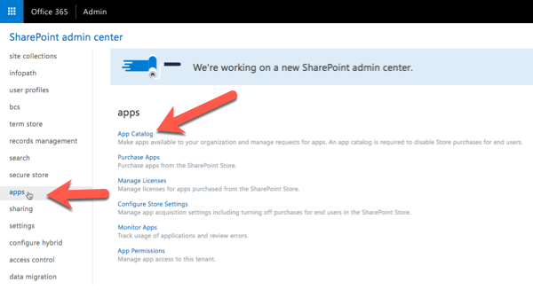
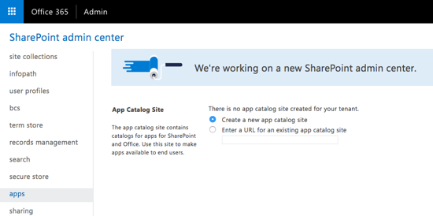
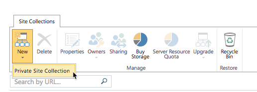
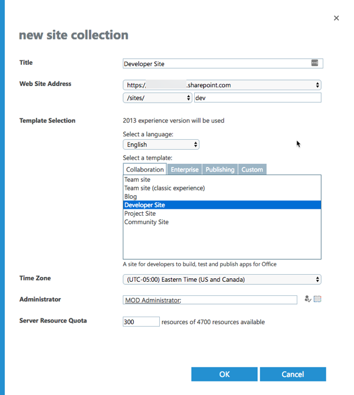
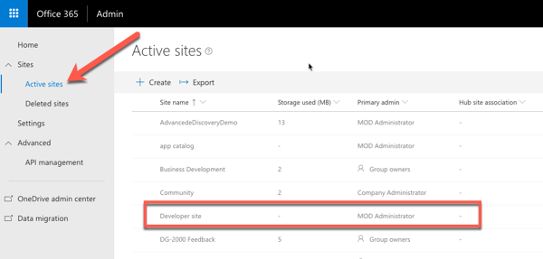

# Create & Configure your SharePoint Online Developer Tenant

In this demo you will configure your SharePoint environment to be ready for SharePoint Framework development. This process involves three steps: creating an app catalog site for your tenant, a developer site collection and a site collection app catalog in your developer site collection.

## Create app catalog for your SharePoint tenant

1. Open a browser and navigate to your Office 365 tenant's **SharePoint Admin Center** site: **https://{{REPLACE_WITH_YOUR_TENANTID}}-admin.sharepoint.com**

    > Replace the text `{{REPLACE_WITH_YOUR_TENANTID}}` in the above URL with the unique prefix for your Office 365 tenant.

1. In the left-hand navigation, select **apps**.
1. When the page refreshes, select **app catalog**.

    

    > If you are taken to an app catalog site as shown in the following image, then your tenant already has an app catalog, created by someone previously. SharePoint Online tenancies can only have one app catalog. In this case, you can skip to the next step to create a developer site collection.
    >
    > 
    >
    > Otherwise, if you are presented with a form to create an app catalog (*as shown in the following image*), your tenant does not already have an app catalog. In this case, continue with the following steps to create an app catalog.
    >
    > 

1. Select **Create a new app catalog site** option & select the **OK** button.
1. On the **Create App Catalog Site Collection** page, enter the following details and select **OK**:
    - **Title**: app catalog
    - **Web Site Address (suffix)**: appcatalog
    - **Administrator**: *enter your username & select the **check names** icon to resolve your username*

    

    SharePoint Online will provision the app catalog for the tenant.

## Create a developer site collection

1. Open a browser and navigate to your Office 365 tenant's **SharePoint Admin Center** site: **https://{{REPLACE_WITH_YOUR_TENANTID}}-admin.sharepoint.com**

    > Replace the text `{{REPLACE_WITH_YOUR_TENANTID}}` in the above URL with the unique prefix for your Office 365 tenant.

1. On the **SharePoint Admin Center** site, select **New > Private Site Collection** from the ribbon menu:

    

1. In the **New Site Collection** dialog, enter the following values to create a new developer site collection and select **OK**:

    - **Title**: Developer Site
    - **Web Site Address (suffix)**: /dev
    - **Template Selection**: Collaboration / Developer Site
    - **Administrator**: *enter your username & select the **check names** icon to resolve your username*

    

> NOTE: After a few minutes the site collection will be created. The default SharePoint Admin Center currently only displays *classic* SharePoint site collections. On this page there will be a banner to preview the **new SharePoint admin center**. Select **Try the preview** to try the new admin center.
>
> In the new **SharePoint Admin Center**, select the **Sites > Active Sites** item in the left-hand menu to see a list of all sites, including *classic* as well as *modern* sites. In this list, you will see the **Developer site** that you just created:
>
> 