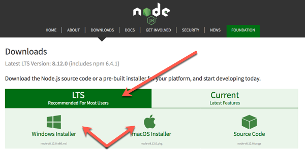

# Setup your local SPFx Developer Environment

In this demo you will setup your local developer environment with everything you need start creating SharePoint Framework components.

## Install a Code Editor

You will need a text editor to edit your code files. There are no requirements for what you need in a text editor.

The remainder of this lab & most examples you find from Microsoft use [Visual Studio Code](https://code.visualstudio.com/).

## Install Node.js

The tools used in compiling, debugging and packaging SharePoint Framework projects are built using Node.js, a runtime that enables JavaScript to run locally vs. a browser. Therefore the first step is to install the runtime, Node.js, before installing the required tools.

1. Open a browser and navigate to the Node.js Foundation site: https://www.nodejs.org.
1. Select **Downloads** from the top menu navigation.
1. Node.js is available in two different releases: the *long term support* release (aka: LTS) is the most stable version that is recommended for most users while the *current* version contains the latest features.

    The SharePoint Framework build toolchain is tested and supported against the current LTS version so this is the version you should obtain.

    Select **LTS** and then select the installer for your developer environment. Both Windows and macOS installers are available. This page contains options for additional installs as well such as SunOS, Linux, AIX and even source code downloads.

    

    > Before installing Node.js, you should verify you haven't previously installed it as part of another install. Open a command prompt or terminal (depending on your developer platform) and execute the following command:
    >
    > ```shell
    > node -v
    > ```
    >
    > If a version number is returned, you already have Node. As long as the version you have installed has a major version that matches the LTS version listed on the Node.js Foundation site, you do not need to download and install a newer version.
    >
    > In the case where you have a version of Node.js installed with a major version number that matches the current LTS version, skip installing Node.js and proceed to the next section.

1. Run the installer to install Node.js and the included version of NPM (*a package manager that Node.js uses, similar to .NET's NuGet*).

## Install Required Tools

The SharePoint Framework development experience utilizes a set of tools built on Node.js that are popular among web developers. These tools are built on Node.js which means they can be used on any platform and will work the same way. This includes Windows, macOS and Linux.

1. Install Yeoman - http://yeoman.io

    Yeoman is a scaffolding engine which executes *generators* that prompt the user with questions. Based on the answers to these questions, Yeoman then creates the folders and files defined by the generator.

      1. Open a command prompt / terminal window and execute the following command to install Yeoman globally with NPM:

          ```shell
          npm install --global yo
          ```

1. Install the SharePoint Framework Yeoman generator.

    Microsoft has created a Yeoman generator for scaffolding SharePoint Framework projects.

      1. Open a command prompt / terminal window and execute the following command to install the SharePoint Framework Yeoman generator globally with NPM:

          ```shell
          npm install --global @microsoft/generator-sharepoint
          ```

1. Install Gulp - https://gulpjs.com

    Gulp is a task runner utility. It's similar to MSBuild, a tool used by .NET developers and Visual Studio to compile projects, package solutions into redistributes and start a debugging experience.

      1. Open a command prompt / terminal window and execute the following command to install Gulp globally with NPM:

          ```shell
          npm install --global gulp
          ```